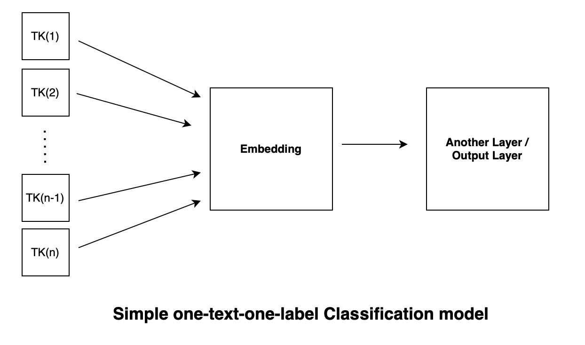

## Description

This repository aims to form intuitions about how to build and train simple deep learning models for text classification tasks from scratch using [paddle](https://github.com/PaddlePaddle/Paddle), [PyTorch](https://github.com/pytorch/pytorch), and [TensorFlow](https://github.com/tensorflow/tensorflow). GPUs are not required. 

We will build five deep learning models (BoW, CNN, RNN, LSTM, and GRU, or three types: BoW, CNN, and RNNs) adopting one simple but general architecture. We will also learn the ins and outs of text data preprocessing for training deep learning models using our own methods (which appears to be simpler and easier to learn) as well as common practices advocated by those deep learning frameworks. 

**One interesting fact** about this repository is that, I tried to twist `PyTorch` and `TensorFlow` to fit the way I built the models initially using `paddle`. I find it beneficial for myself to tell the nuances as well as commonalities among different deep learning frameworks, although doing so may not feel easy at first and certainly does not represent the best ways of employing those deep learning frameworks that I twisted. 

This repository is closely related to another repository called [text-matching-explained](https://github.com/jaaack-wang/text-matching-explained). These two repositories are siblings because the baisc architectures for the five models are same except that models constucted here are able to take as inputs two pieces of texts instead of one single text. Therefore, you will simple large amounts of overlaps between these two repositories if you are interested in both. 

## General architecture

The general architecture for the five models can be illustrated as follows: first, we encode the input text in the form of embedding, which will go through certain number of layers (can be 0) until it reaches the output layer. 

**Please note that**, 

- the arrow means a process, or more specifically a function (let's be philosophical, no function at all is also a function, i.e., f(x)=x) that values from previous layer needs to go through; 
- the number of layers can be arbitrarily large, but our models are basically all three layers (including the input layer, but excluding the inserted CNN, RNNs, which are taken as a function here for illustration).
- **The key difference among these models** how the embedding is processed or **encoded** before going through another hidden layer or the output layer. If you read the source codes for the five models, you can see the **encoders** for the five models are what makes a model a model. 

 

